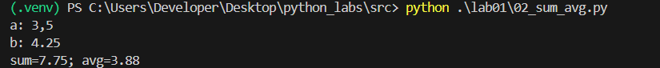
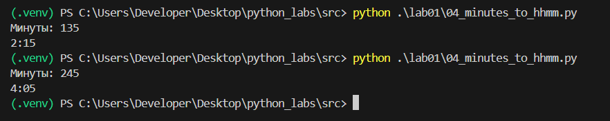
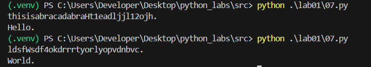

## Лабораторная работа 1

### Задание 1
```python
name = input('Имя: ')
age = int(input('Возраст: '))
print(f'Привет, {name}! Через год тебе будет {age+1}.')
```


### Задание 2
```python
input1 = input("a: ")
a = float(input1.replace(',', '.'))
input2 = input("b: ")
b = float(input2.replace(',', '.'))
print(f'sum={round(a+b, 2)}; avg={round((a+b)/2, 2)}')
```


### Задание 3
```python
price = int(input("Price (₽): "))
discount = int(input("Discount (%): "))
vat = int(input('Vat (%): '))
base = price * (1 - discount/100)
vat_amount = base * (vat/100)
total = base + vat_amount
print(f'База после скидки: {format(base, '.2f')} ₽')
print(f'НДС: {format(vat_amount, '.2f')} ₽')
print(f'Итого к оплате: {format(total, '.2f')} ₽')
```


### Задание 4
```python
minutes = int(input('Минуты: '))
print(f'{minutes//60}:{minutes%60:02d}')
```


### Задание 5
```python
minutes = int(input('Минуты: '))
print(f'{minutes//60}:{minutes%60:02d}')
```


### Задание 6
```python
n = int(input())
och = 0
zaoch = 0
for i in range(n):
    format = input().split()[-1]
    if format == "True":
        och += 1
    else:
        zaoch += 1
print(och, zaoch)
```


### Задание 7
```python
s = input()
ans = ''
found_first = False
first_index = 0
for i, symbol in enumerate(s):
    if symbol.isupper() and not found_first:
        ans += symbol
        found_first = True
        first_index = i
    if found_first:
        if symbol.isdigit():
            ans += s[i+1]
            step = i+1 - first_index
            j = i+1+step
            while s[j] != '.':
                ans += s[j]
                j += step
            ans += s[j]
            break
print(ans)
```
