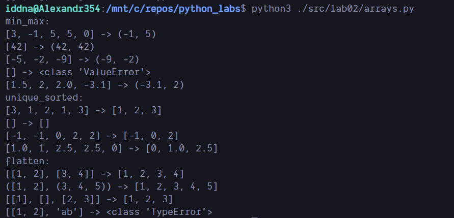
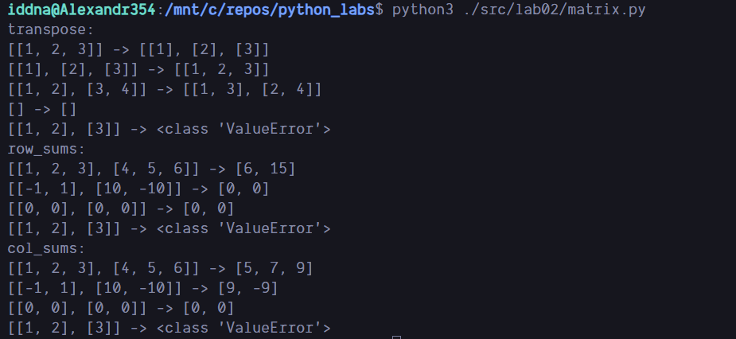
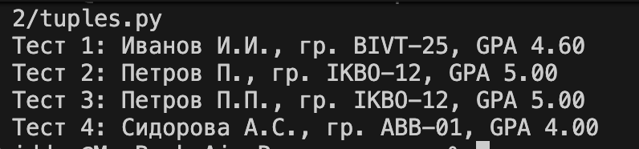

## Лабораторная работа 2

### Задание 1

```python
def min_max(nums):
  if nums:
    return (min(nums), max(nums))
  else:
    return ValueError

def unique_sorted(nums):
  return sorted(set(nums))

def flatten(mat):
  arr = []
  for x in mat:
    if not isinstance(x, list) and not isinstance(x, tuple):
      return TypeError
    arr.extend(x)
  return arr
```



### Задание 2

```python
def transpose(mat):
  if len(mat) == 0: return []
  new_mat = [[] for x in mat[0]]
  for row in mat:
    if len(row) != len(new_mat):
      return ValueError
    for i, x in enumerate(row):
      new_mat[i].append(x)
  return new_mat

def row_sums(mat):
  for row in mat:
    if len(row) != len(mat[0]):
      return ValueError
  return [sum(row) for row in mat]

def col_sums(mat):
  if len(mat) == 0: return []
  new_mat = [0 for x in mat[0]]
  for row in mat:
    if len(row) != len(new_mat):
      return ValueError
    for i, x in enumerate(row):
      new_mat[i] += x
  return new_mat
```



### Задание 2

```python
def format_record(rec: tuple) -> str:
  """
    Форматирует запись студента в строку.

    Args:
        rec: Кортеж (fio: str, group: str, gpa: float)

    Returns:
        Строка формата: "Фамилия И.О., гр. GROUP, GPA X.XX"

    Raises:
        ValueError: Если ФИО или группа пустые, или GPA отрицательный
        TypeError: Если типы данных не соответствуют ожидаемым
  """
  if not isinstance(rec, tuple) or len(rec) != 3:
    raise TypeError("Запись должна быть кортежем из 3 элементов")

  fio, group, gpa = rec

  if not isinstance(fio, str):
    return TypeError("ФИО должно быть строкой")
  if not isinstance(group, str):
    return TypeError("Группа должна быть строкой")
  if not isinstance(gpa, (int, float)):
    return TypeError("GPA должно быть числом")

  # Проверка значений
  fio_clean = ' '.join(fio.split()).strip()
  if not fio_clean:
      raise ValueError("ФИО не может быть пустым")

  group_clean = group.strip()
  if not group_clean:
      raise ValueError("Группа не может быть пустой")

  if gpa < 0:
      raise ValueError("GPA не может быть отрицательным")

  # Обработка ФИО
  parts = fio_clean.split()
  surname = parts[0]

  # Формирование инициалов
  initials = []
  for name_part in parts[1:]:
      if name_part:
          initials.append(f"{name_part[0].upper()}.")

  if not initials:
      formatted_fio = surname
  else:
      formatted_fio = f"{surname} {''.join(initials)}"

  # Форматирование GPA с 2 знаками после запятой
  formatted_gpa = f"{gpa:.2f}"

  return f"{formatted_fio}, гр. {group_clean}, GPA {formatted_gpa}"
```


