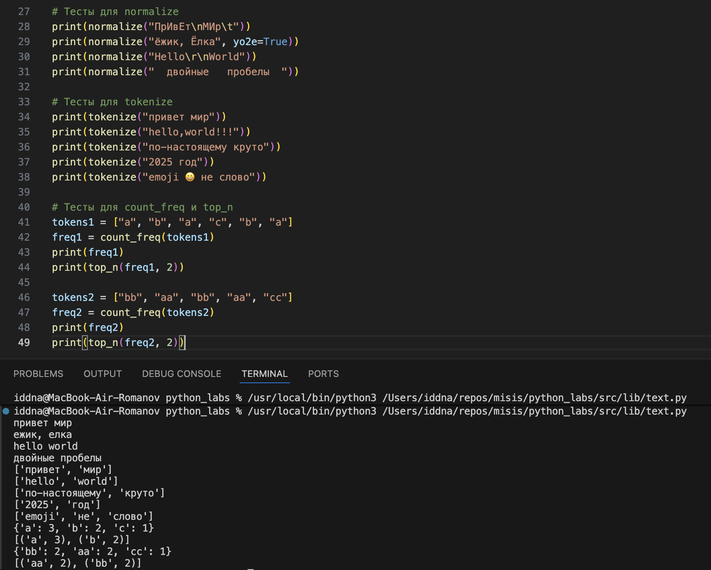
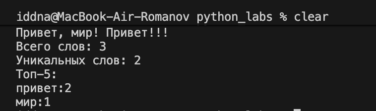

## Лабораторная работа 3

### Задание 1

```python
import re

def normalize(text: str, *, casefold: bool = True, yo2e: bool = True) -> str:
    if casefold: text = text.casefold()
    if yo2e: text = text.replace('Ё', 'Е').replace('ё', 'е')
    text = ' '.join(text.strip().split())
    return text

def tokenize(text: str) -> list[str]:
    pattern = r'\w+(?:-\w+)*'
    tokens = re.findall(pattern, text)
    return tokens

def count_freq(tokens: list[str]) -> dict[str, int]:
    freq = {}
    for token in tokens:
        freq[token] = freq.get(token, 0) + 1
    return freq

def top_n(freq: dict[str, int], n: int = 5) -> list[tuple[str, int]]:
    sorted_items = sorted(
        freq.items(),
        key=lambda x: (-x[1], x[0])
    )
    return sorted_items[:n]
```



### Задание 2

```python
import sys

from src.lib.text import normalize, tokenize, count_freq, top_n

# Чтение всего ввода из stdin
text = sys.stdin.readline()

# Нормализация текста
normalized_text = normalize(text)

# Токенизация
tokens = tokenize(normalized_text)

# Подсчет статистики
total_words = len(tokens)
freq_dict = count_freq(tokens)
unique_words = len(freq_dict)
top_words = top_n(freq_dict, 5)

# Вывод результатов
print(f"Всего слов: {total_words}")
print(f"Уникальных слов: {unique_words}")
print("Топ-5:")

for word, count in top_words:
    print(f"{word}:{count}")
```


