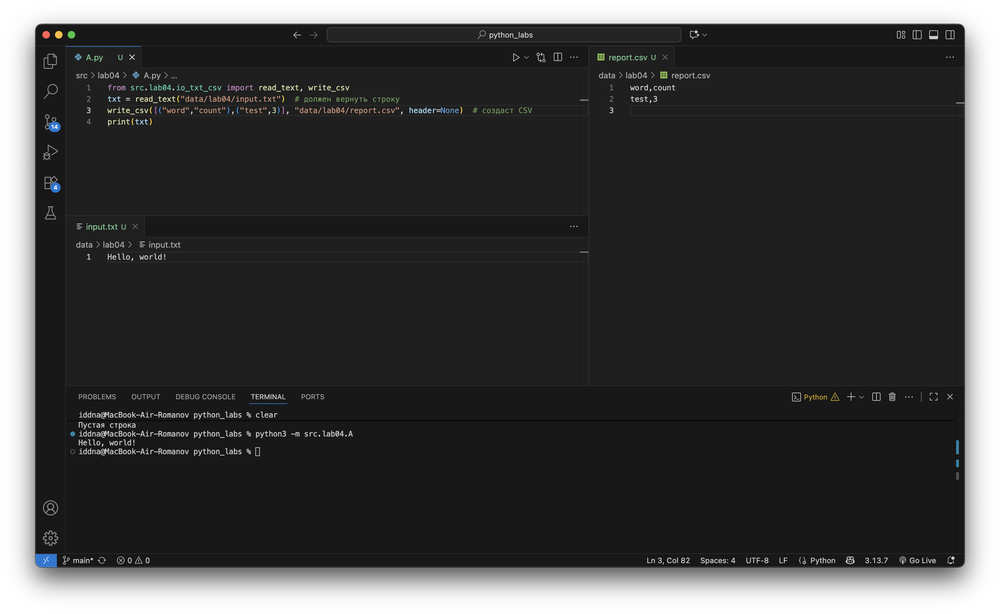
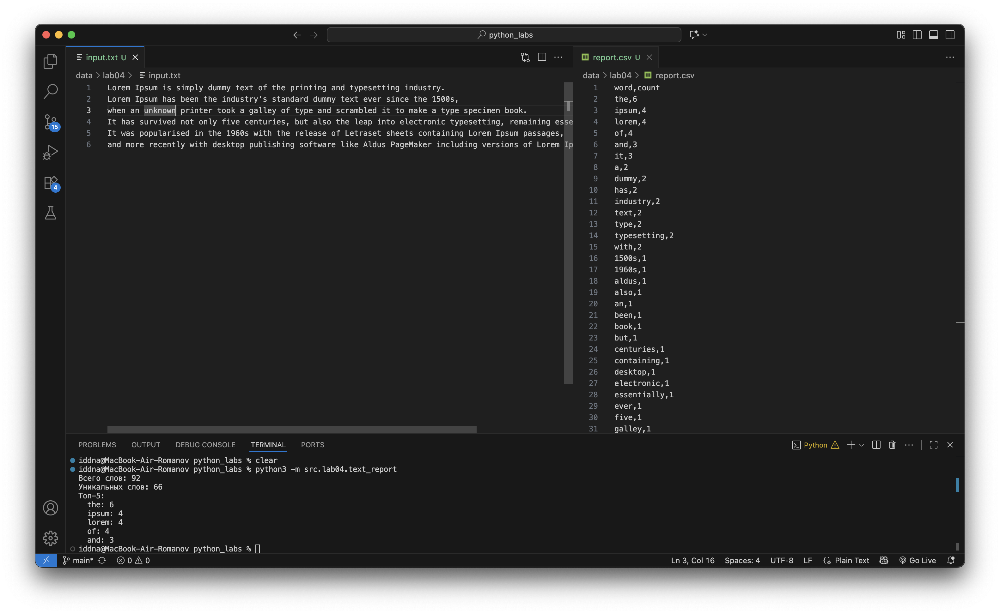

## Лабораторная работа 4

### Задание A

```python
import csv
from pathlib import Path
from typing import Iterable, Sequence


def read_text(path: str | Path, encoding: str = "utf-8") -> str:
    """
    Открывает текстовый файл и возвращает его содержимое как строку.
    Если нужно использовать другую кодировку (например, Windows-1251), 
    можно вызвать так:
        text = read_text("data/file.txt", encoding="cp1251")

    Аргументы:
        path (str | Path): путь к файлу.
        encoding (str, optional): кодировка файла. По умолчанию "utf-8".
            Можно указать другую, например encoding="cp1251".

    Исключения:
        FileNotFoundError — если файл не найден.
        UnicodeDecodeError — если файл не удаётся прочитать в данной кодировке.

    Возвращает:
        str: содержимое файла.
    """
    p = Path(path)
    return p.read_text(encoding=encoding)


def ensure_parent_dir(path: str | Path) -> None:
    """
    Создаёт родительские директории для файла, если их нет.
    """
    Path(path).parent.mkdir(parents=True, exist_ok=True)


def write_csv(
    rows: Iterable[Sequence],
    path: str | Path,
    header: tuple[str, ...] | None = None
) -> None:
    """
    Создаёт CSV-файл с разделителем ",".
    Если передан header — записывает его первой строкой.
    Проверяет, что все строки rows имеют одинаковую длину, иначе ValueError.

    Аргументы:
        rows (Iterable[Sequence]): последовательность строк (списки или кортежи).
        path (str | Path): путь к создаваемому файлу.
        header (tuple[str, ...] | None): необязательная строка заголовков.

    Исключения:
        ValueError — если строки в rows имеют разную длину.
    """
    rows = list(rows)
    ensure_parent_dir(path)

    # Проверяем равенство длины строк (если не пусто)
    if rows:
        lengths = {len(r) for r in rows}
        if len(lengths) > 1:
            raise ValueError("Все строки в rows должны иметь одинаковую длину")

    p = Path(path)
    with p.open("w", newline="", encoding="utf-8") as f:
        writer = csv.writer(f)
        if header is not None:
            writer.writerow(header)
        for r in rows:
            writer.writerow(r)
```



### Задание B

```python
"""
Скрипт для анализа текста и генерации отчёта в формате CSV.

Функции:
- Читает входной файл (по умолчанию data/input.txt)
- Нормализует и токенизирует текст (используя lib/text.py)
- Считает частоты слов и сортирует их (по частоте ↓, затем по слову ↑)
- Сохраняет результат в CSV (по умолчанию data/report.csv)
- Печатает краткое резюме в консоль

Пример запуска:
    python src/lab04/text_report.py
    python src/lab04/text_report.py --in data/in.txt --out data/out.csv
    python src/lab04/text_report.py --in data/in.txt --encoding cp1251

Если входной файл не существует — выводит сообщение и завершает работу с кодом 1.
Если файл пустой — создаётся report.csv только с заголовком word,count.
"""

import sys
import argparse
from pathlib import Path

from src.lab04.io_txt_csv import read_text, write_csv
from src.lib.text import normalize, tokenize, count_freq, top_n

def main() -> None:
    """Точка входа в программу."""
    parser = argparse.ArgumentParser(description="Создание отчёта частот слов из текстового файла.")
    parser.add_argument("--in", dest="input_path", default="data/lab04/input.txt", help="входной текстовый файл (по умолчанию data/input.txt)")
    parser.add_argument("--out", dest="output_path", default="data/lab04/report.csv", help="файл для сохранения отчёта (по умолчанию data/report.csv)")
    parser.add_argument("--encoding", default="utf-8", help="кодировка входного файла (по умолчанию utf-8, можно cp1251 и др.)")

    args = parser.parse_args()
    input_path = Path(args.input_path)
    output_path = Path(args.output_path)

    # Проверка существования входного файла
    if not input_path.exists():
        print(f"Ошибка: входной файл '{input_path}' не найден.", file=sys.stderr)
        sys.exit(1)

    # Чтение и анализ текста
    try:
        text = read_text(input_path, encoding=args.encoding)
    except UnicodeDecodeError:
        print(f"Ошибка: не удалось прочитать '{input_path}' в кодировке {args.encoding}.", file=sys.stderr)
        sys.exit(1)

    freq = count_freq(tokenize(normalize(text)))
    sorted_rows = top_n(freq, len(freq))

    # Если текст пустой — пишем только заголовок
    if not sorted_rows:
        write_csv([], output_path, header=("word", "count"))
        print("Файл пустой. Создан отчёт только с заголовком.")
        return

    # Записываем результат в CSV
    write_csv(sorted_rows, output_path, header=("word", "count"))

    # Выводим краткое резюме
    total_words = sum(freq.values())
    unique_words = len(freq)
    top_5 = sorted_rows[:5]

    print(f"Всего слов: {total_words}")
    print(f"Уникальных слов: {unique_words}")
    print("Топ-5:")
    for w, c in top_5:
        print(f"  {w}: {c}")


if __name__ == "__main__":
    main()
```


