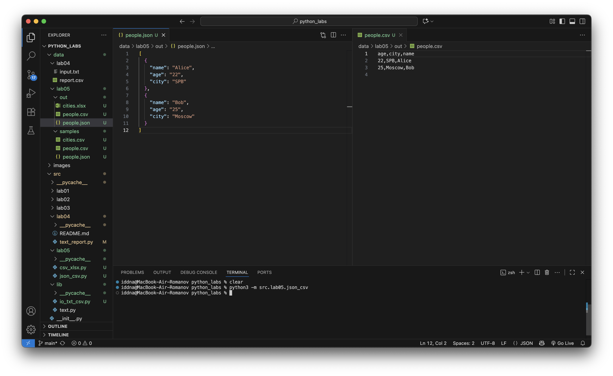
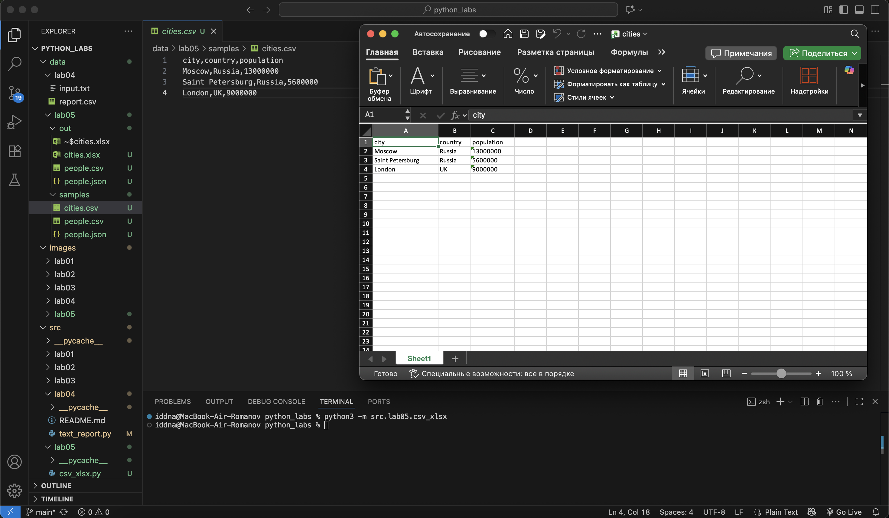

## Лабораторная работа 5

### Задание A

```python
import json
import csv
from pathlib import Path

from src.lib.io_txt_csv import ensure_parent_dir

def json_to_csv(json_path: str, csv_path: str) -> None:
    """Преобразует JSON (список словарей) в CSV."""
    json_path = Path(json_path)
    csv_path = Path(csv_path)

    if not json_path.exists():
        raise FileNotFoundError(f"JSON-файл '{json_path}' не найден.")

    with json_path.open("r", encoding="utf-8") as f:
        data = json.load(f)

    if not isinstance(data, list) or not all(isinstance(x, dict) for x in data):
        raise ValueError("JSON должен быть списком словарей.")

    if not data:
        raise ValueError("JSON-файл пуст.")

    # Собираем все ключи (чтобы заполнить пропуски пустыми строками)
    fieldnames = sorted({key for item in data for key in item.keys()})

    ensure_parent_dir(csv_path)
    with csv_path.open("w", newline="", encoding="utf-8") as f:
        writer = csv.DictWriter(f, fieldnames=fieldnames)
        writer.writeheader()
        for row in data:
            writer.writerow({k: row.get(k, "") for k in fieldnames})

def csv_to_json(csv_path: str, json_path: str) -> None:
    """Преобразует CSV в JSON (список словарей)."""
    csv_path = Path(csv_path)
    json_path = Path(json_path)

    if not csv_path.exists():
        raise FileNotFoundError(f"CSV-файл '{csv_path}' не найден.")

    with csv_path.open("r", newline="", encoding="utf-8") as f:
        reader = csv.DictReader(f)
        rows = list(reader)

    if not rows:
        raise ValueError("CSV-файл пуст.")

    ensure_parent_dir(json_path)
    with json_path.open("w", encoding="utf-8") as f:
        json.dump(rows, f, ensure_ascii=False, indent=2)
```



### Задание B

```python
from pathlib import Path
import csv
from openpyxl import Workbook

def csv_to_xlsx(csv_path: str, xlsx_path: str) -> None:
    """
    Конвертирует CSV в XLSX.
    Первая строка CSV — заголовок.
    Лист называется "Sheet1".
    Колонки — автоширина по длине текста (не менее 8 символов).
    Кодировка: UTF-8.
    """

    csv_file = Path(csv_path)
    if not csv_file.exists():
        raise FileNotFoundError(f"CSV-файл '{csv_path}' не найден.")

    # Читаем CSV
    with csv_file.open(encoding="utf-8") as f:
        reader = list(csv.reader(f))
        if not reader:
            raise ValueError("Пустой CSV-файл")

    # Создаём Excel-файл
    wb = Workbook()
    ws = wb.active
    ws.title = "Sheet1"

    # Добавляем строки
    for row in reader:
        ws.append(row)

    # Автоширина колонок (минимум 8)
    for col in ws.columns:
        max_len = 0
        col_letter = col[0].column_letter  # A, B, C...
        for cell in col:
            val = str(cell.value) if cell.value is not None else ""
            max_len = max(max_len, len(val))
        ws.column_dimensions[col_letter].width = max(max_len + 2, 8)

    # Сохраняем результат
    wb.save(xlsx_path)
```


