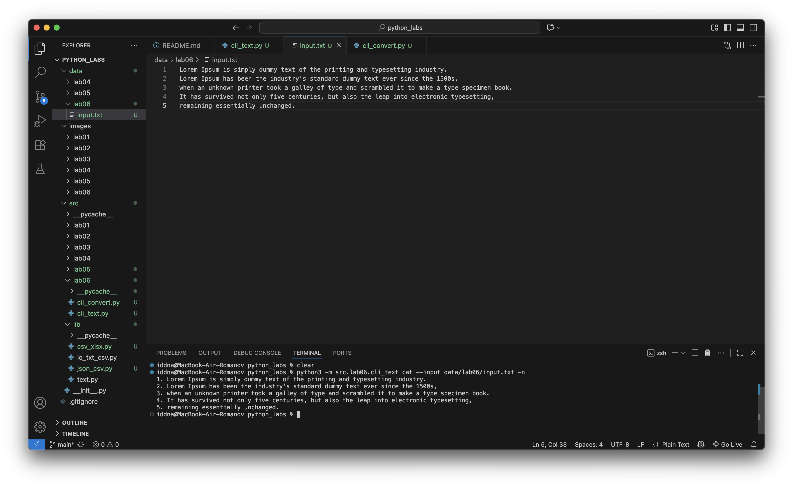
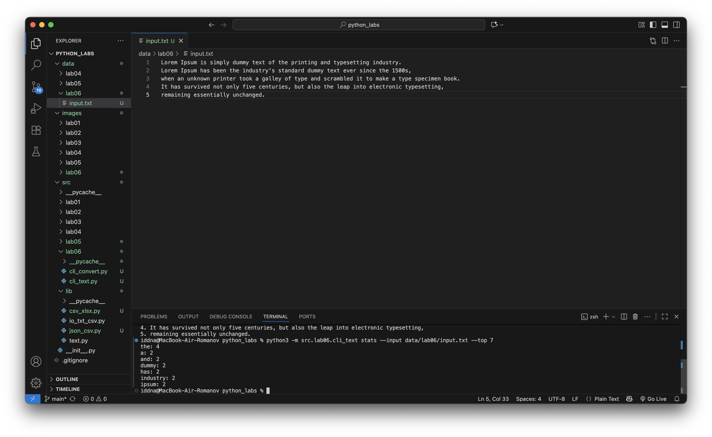
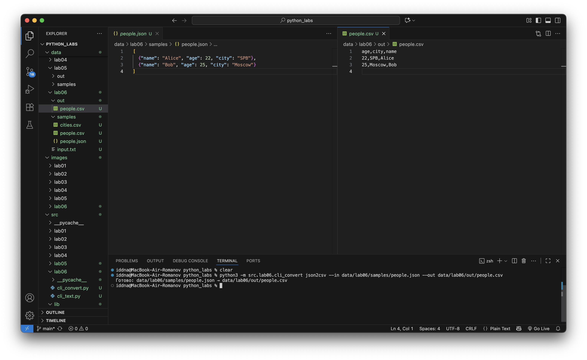
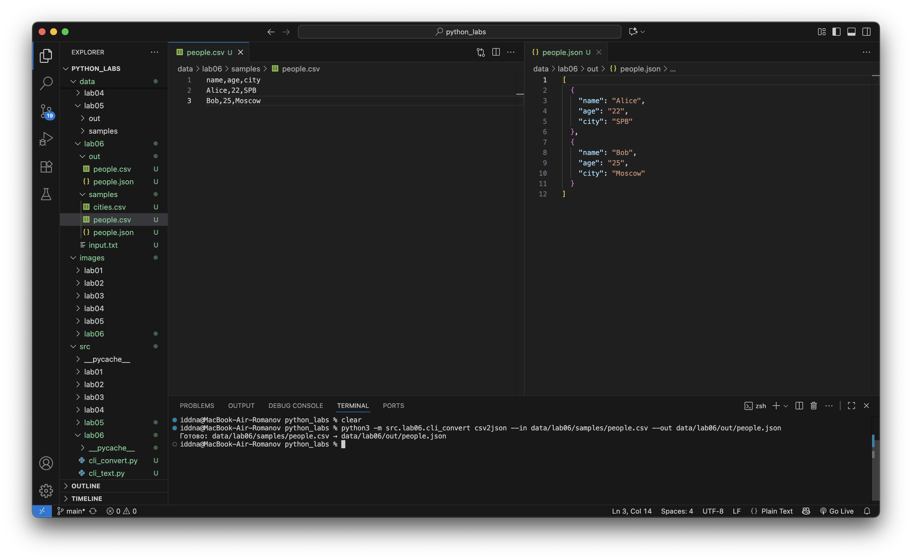
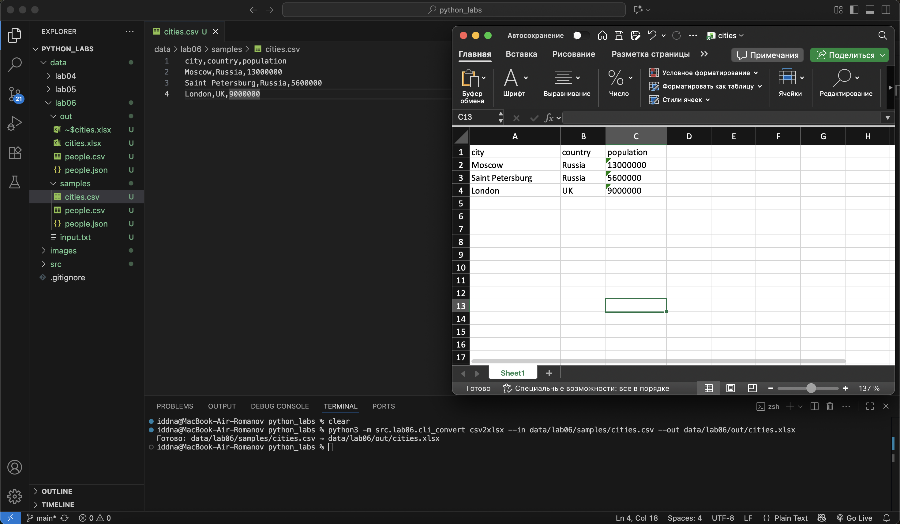

## Лабораторная работа 6

### Задание A

```python
import argparse
from pathlib import Path
from src.lib.text import normalize, tokenize, count_freq, top_n


def cmd_cat(path: Path, number_lines: bool) -> None:
    """
    Выводит содержимое текстового файла построчно.
    
    Параметры:
        path (str): путь к файлу.
        number_lines (bool): если True — добавляет нумерацию строк.
    
    Исключения:
        FileNotFoundError — если файл не существует.
    """

    if not path.exists():
        raise FileNotFoundError(f"Файл '{path}' не найден")

    with path.open(encoding="utf-8") as f:
        for i, line in enumerate(f, start=1):
            line = line.rstrip("\n")
            if number_lines:
                print(f"{i}. {line}")
            else:
                print(line)


def cmd_stats(path: Path, top_k: int) -> None:
    """
    Анализирует текстовый файл и выводит статистику по словам:
    общее количество слов, уникальных слов и топ-N наиболее частых.

    Параметры:
        path (str): путь к текстовому файлу.
        top_n (int): сколько самых частых слов выводить.

    Использует функции нормализации, токенизации и подсчёта частот из lab03.

    Исключения:
        FileNotFoundError — если файл отсутствует.
        ValueError — если файл пуст.
    """

    if not path.exists():
        raise FileNotFoundError(f"Файл '{path}' не найден")

    text = path.read_text(encoding="utf-8")
    text = normalize(text)
    words = tokenize(text)
    freqs = count_freq(words)
    top = top_n(freqs, top_k)

    for word, count in top:
        print(f"{word}: {count}")


def main():
    """
    Точка входа CLI-утилиты.

    Создаёт парсер argparse, добавляет подкоманды:
        - cat   — вывод файла
        - stats — статистика слов
    
    Вызывает соответствующие функции в зависимости от аргументов.
    """

    parser = argparse.ArgumentParser(
        description="CLI-утилиты анализа текста: cat и stats"
    )
    subparsers = parser.add_subparsers(dest="command")

    # ---------------------- CAT ------------------------
    cat_p = subparsers.add_parser("cat", help="Вывести содержимое файла")
    cat_p.add_argument("--input", required=True, help="Путь к файлу")
    cat_p.add_argument(
        "-n",
        action="store_true",
        help="Нумеровать строки"
    )

    # ---------------------- STATS ----------------------
    stats_p = subparsers.add_parser("stats", help="Частотный анализ текста")
    stats_p.add_argument("--input", required=True, help="Путь к текстовому файлу")
    stats_p.add_argument(
        "--top",
        type=int,
        default=5,
        help="Количество наиболее частых слов (по умолчанию 5)",
    )

    args = parser.parse_args()

    # ------------ обработка подкоманд -----------------
    if args.command == "cat":
        cmd_cat(Path(args.input), args.n)

    elif args.command == "stats":
        cmd_stats(Path(args.input), args.top)

    else:
        parser.error("Не указана подкоманда (cat или stats)")


if __name__ == "__main__":
    main()
```




### Задание B 

```python
from pathlib import Path
import csv
from openpyxl import Workbook

def csv_to_xlsx(csv_path: str, xlsx_path: str) -> None:
    """
    Конвертирует CSV в XLSX.
    Первая строка CSV — заголовок.
    Лист называется "Sheet1".
    Колонки — автоширина по длине текста (не менее 8 символов).
    Кодировка: UTF-8.
    """

    csv_file = Path(csv_path)
    if not csv_file.exists():
        raise FileNotFoundError(f"CSV-файл '{csv_path}' не найден.")

    # Читаем CSV
    with csv_file.open(encoding="utf-8") as f:
        reader = list(csv.reader(f))
        if not reader:
            raise ValueError("Пустой CSV-файл")

    # Создаём Excel-файл
    wb = Workbook()
    ws = wb.active
    ws.title = "Sheet1"

    # Добавляем строки
    for row in reader:
        ws.append(row)

    # Автоширина колонок (минимум 8)
    for col in ws.columns:
        max_len = 0
        col_letter = col[0].column_letter  # A, B, C...
        for cell in col:
            val = str(cell.value) if cell.value is not None else ""
            max_len = max(max_len, len(val))
        ws.column_dimensions[col_letter].width = max(max_len + 2, 8)

    # Сохраняем результат
    wb.save(xlsx_path)
```




