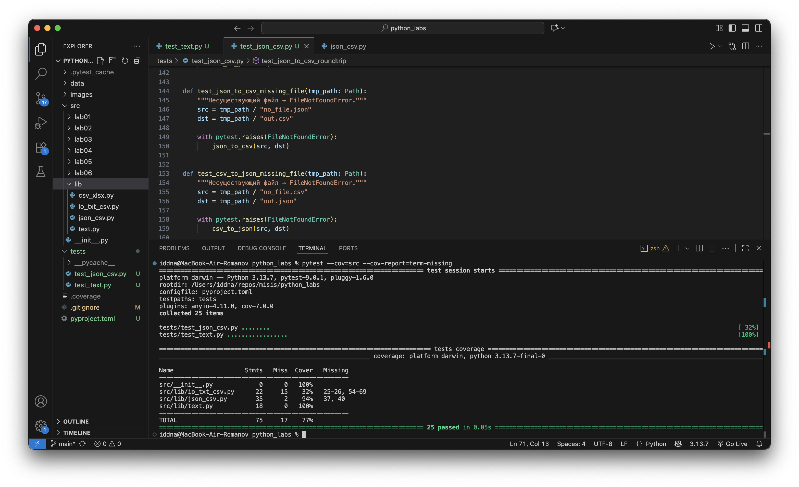

## Лабораторная работа 7

### Задание A

```python
import pytest
from src.lib.text import normalize, tokenize, count_freq, top_n


# ------------------------
# TEST normalize
# ------------------------


@pytest.mark.parametrize(
    "text, expected",
    [
        ("Привет  мир", "привет мир"),
        ("  Текст   с   пробелами   ", "текст с пробелами"),
        ("Ёжик ёлку нашёл", "ежик елку нашел"),
        ("", ""),
    ],
)
def test_normalize_basic(text, expected):
    assert normalize(text) == expected


def test_normalize_casefold_off():
    assert normalize("ПрИвЕт", casefold=False) == "ПрИвЕт"


def test_normalize_yo2e_off():
    assert normalize("ёж", yo2e=False) == "ёж"


# ------------------------
# TEST tokenize
# ------------------------


@pytest.mark.parametrize(
    "text, expected",
    [
        ("hello world", ["hello", "world"]),
        ("тест-токенизации слов", ["тест-токенизации", "слов"]),
        ("слово1 слово2", ["слово1", "слово2"]),
        ("!!!", []),
        ("", []),
    ],
)
def test_tokenize(text, expected):
    assert tokenize(text) == expected


# ------------------------
# TEST count_freq
# ------------------------


def test_count_freq_basic():
    tokens = ["a", "b", "a", "a", "c", "b"]
    assert count_freq(tokens) == {"a": 3, "b": 2, "c": 1}


def test_count_freq_empty():
    assert count_freq([]) == {}


# ------------------------
# TEST top_n
# ------------------------


def test_top_n_basic():
    freq = {"a": 3, "b": 1, "c": 2}
    assert top_n(freq, 2) == [("a", 3), ("c", 2)]


def test_top_n_equal_freq_sorted_alphabetically():
    freq = {"beta": 1, "alpha": 1, "gamma": 1}
    # одинаковая частота → сортировка по алфавиту
    assert top_n(freq, 3) == [
        ("alpha", 1),
        ("beta", 1),
        ("gamma", 1),
    ]


def test_top_n_more_than_size():
    freq = {"one": 2, "two": 1}
    # просим топ-10, но слов всего 2
    assert top_n(freq, 10) == [("one", 2), ("two", 1)]


def test_top_n_zero():
    freq = {"a": 1, "b": 2}
    assert top_n(freq, 0) == []
```

### Задание B 

```python
import json
import csv
import pytest
from pathlib import Path
from src.lib.json_csv import json_to_csv, csv_to_json


# -------------------------
#  JSON → CSV (позитивные)
# -------------------------


def test_json_to_csv_basic(tmp_path: Path):
    """Проверка корректной конвертации JSON → CSV."""
    src = tmp_path / "people.json"
    dst = tmp_path / "people.csv"

    data = [
        {"name": "Alice", "age": 22},
        {"name": "Bob", "age": 25},
    ]

    src.write_text(json.dumps(data, ensure_ascii=False), encoding="utf-8")

    json_to_csv(src, dst)

    with dst.open(encoding="utf-8") as f:
        reader = list(csv.DictReader(f))

    assert len(reader) == 2
    assert reader[0]["name"] == "Alice"
    assert set(reader[0].keys()) == {"name", "age"}


# -------------------------
#  CSV → JSON (позитивные)
# -------------------------


def test_csv_to_json_basic(tmp_path: Path):
    """Проверка корректной конвертации CSV → JSON."""
    src = tmp_path / "people.csv"
    dst = tmp_path / "people.json"

    rows = [
        ["name", "age"],
        ["Alice", "22"],
        ["Bob", "25"],
    ]

    with src.open("w", encoding="utf-8") as f:
        writer = csv.writer(f)
        writer.writerows(rows)

    csv_to_json(src, dst)

    data = json.loads(dst.read_text(encoding="utf-8"))

    assert len(data) == 2
    assert data[1]["name"] == "Bob"
    assert set(data[0].keys()) == {"name", "age"}


# ------------------------------------
#  JSON → CSV → JSON (round trip)
# ------------------------------------


def test_json_to_csv_roundtrip(tmp_path: Path):
    src = tmp_path / "people.json"
    mid = tmp_path / "people.csv"
    dst = tmp_path / "people2.json"

    data = [
        {"name": "Alice", "age": 22},
        {"name": "Bob", "age": 25},
    ]

    src.write_text(json.dumps(data, ensure_ascii=False), encoding="utf-8")

    json_to_csv(src, mid)
    csv_to_json(mid, dst)

    data2 = json.loads(dst.read_text(encoding="utf-8"))

    assert data2 == [
        {"name": "Alice", "age": "22"},
        {"name": "Bob", "age": "25"},
    ]


# ------------------------------------
#  CSV → JSON → CSV (round trip)
# ------------------------------------


def test_csv_to_json_roundtrip(tmp_path: Path):
    src = tmp_path / "data.csv"
    mid = tmp_path / "data.json"
    dst = tmp_path / "data2.csv"

    rows = [
        ["city", "pop"],
        ["Moscow", "12000000"],
        ["Paris", "2200000"],
    ]

    with src.open("w", encoding="utf-8") as f:
        writer = csv.writer(f)
        writer.writerows(rows)

    csv_to_json(src, mid)
    json_to_csv(mid, dst)

    with dst.open(encoding="utf-8") as f:
        result = list(csv.DictReader(f))

    assert len(result) == 2
    assert set(result[0].keys()) == {"city", "pop"}


# ------------------------------
#      Негативные тесты
# ------------------------------


def test_json_to_csv_invalid_json(tmp_path: Path):
    """Некорректный JSON → ValueError."""
    src = tmp_path / "bad.json"
    dst = tmp_path / "out.csv"

    src.write_text("{bad_json:]", encoding="utf-8")

    with pytest.raises(ValueError):
        json_to_csv(src, dst)


def test_csv_to_json_invalid_csv(tmp_path: Path):
    """Пустой CSV или без заголовков → ValueError."""
    src = tmp_path / "bad.csv"
    dst = tmp_path / "out.json"

    src.write_text("", encoding="utf-8")

    with pytest.raises(ValueError):
        csv_to_json(src, dst)


def test_json_to_csv_missing_file(tmp_path: Path):
    """Несуществующий файл → FileNotFoundError."""
    src = tmp_path / "no_file.json"
    dst = tmp_path / "out.csv"

    with pytest.raises(FileNotFoundError):
        json_to_csv(src, dst)


def test_csv_to_json_missing_file(tmp_path: Path):
    """Несуществующий файл → FileNotFoundError."""
    src = tmp_path / "no_file.csv"
    dst = tmp_path / "out.json"

    with pytest.raises(FileNotFoundError):
        csv_to_json(src, dst)
```


