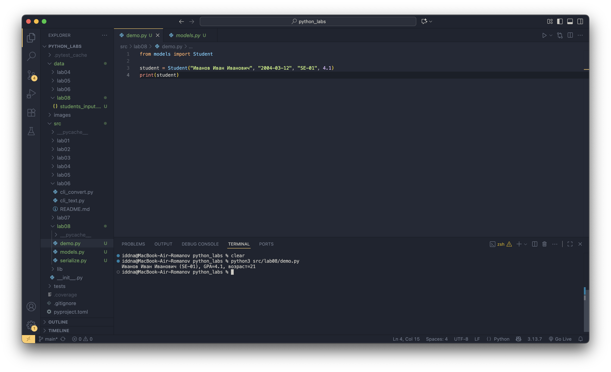
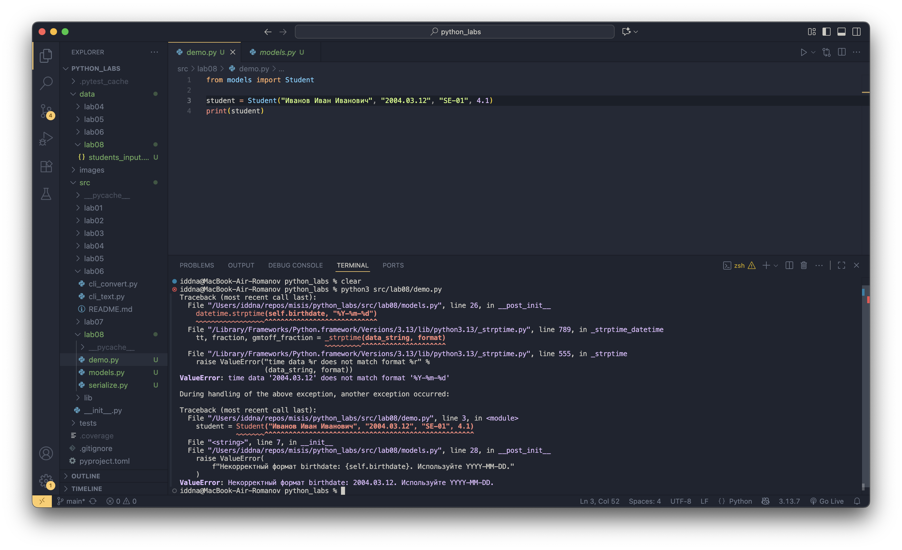
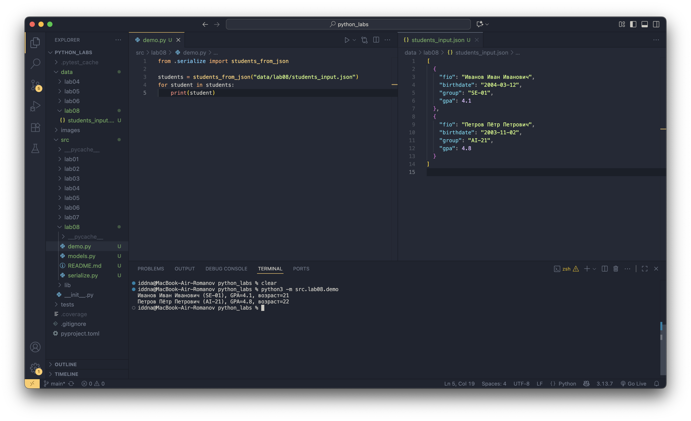

## Лабораторная работа 8

### Задание A

```python
from dataclasses import dataclass
from datetime import datetime, date
from typing import Any, Dict


@dataclass
class Student:
    """
    Модель студента.

    Поля:
        fio: ФИО студента
        birthdate: дата рождения в формате YYYY-MM-DD
        group: учебная группа, напр. SE-01
        gpa: средний балл в диапазоне 0..5
    """

    fio: str
    birthdate: str
    group: str
    gpa: float

    def __post_init__(self):
        # Проверка формата даты
        try:
            datetime.strptime(self.birthdate, "%Y-%m-%d")
        except ValueError:
            raise ValueError(
                f"Некорректный формат birthdate: {self.birthdate}. Используйте YYYY-MM-DD."
            )

        # Проверка GPA
        if not (0 <= self.gpa <= 5):
            raise ValueError("gpa должно быть в диапазоне [0; 5]")

    def age(self) -> int:
        """
        Возвращает количество полных лет.
        """
        b = datetime.strptime(self.birthdate, "%Y-%m-%d").date()
        today = date.today()
        years = today.year - b.year
        # Если ДР ещё не было в этом году — вычитаем один
        if (today.month, today.day) < (b.month, b.day):
            years -= 1
        return years

    def to_dict(self) -> Dict[str, Any]:
        """
        Сериализация объекта студента в словарь.
        """
        return {
            "fio": self.fio,
            "birthdate": self.birthdate,
            "group": self.group,
            "gpa": self.gpa,
        }

    @classmethod
    def from_dict(cls, data: Dict[str, Any]) -> "Student":
        """
        Создание объекта Student из словаря.
        """
        required = {"fio", "birthdate", "group", "gpa"}

        if not required.issubset(data):
            missing = required - data.keys()
            raise ValueError(f"Отсутствуют поля: {', '.join(missing)}")

        return cls(
            fio=data["fio"],
            birthdate=data["birthdate"],
            group=data["group"],
            gpa=float(data["gpa"]),
        )

    def __str__(self) -> str:
        """
        Красивый вывод студента.
        """
        return f"{self.fio} ({self.group}), GPA={self.gpa}, возраст={self.age()}"
```




### Задание B 

```python
import json
from pathlib import Path
from typing import List

from .models import Student
from lib.io_txt_csv import ensure_parent_dir


def students_to_json(students: List[Student], path: str) -> None:
    """
    Сохраняет список объектов Student в JSON-файл.

    Args:
        students: список студентов
        path: путь к выходному JSON
    """
    data = [s.to_dict() for s in students]

    p = Path(path)
    ensure_parent_dir(p)

    with p.open("w", encoding="utf-8") as f:
        json.dump(data, f, ensure_ascii=False, indent=2)


def students_from_json(path: str) -> List[Student]:
    """
    Загружает список студентов из JSON-файла.

    Returns:
        list[Student]
    """
    p = Path(path)

    if not p.exists():
        raise FileNotFoundError(f"Файл не найден: {p}")

    with p.open(encoding="utf-8") as f:
        data = json.load(f)

    if not isinstance(data, list):
        raise ValueError("JSON должен содержать массив объектов")

    students = []
    for item in data:
        if not isinstance(item, dict):
            raise ValueError("Каждая запись JSON должна быть объектом")
        students.append(Student.from_dict(item))

    return students
```


